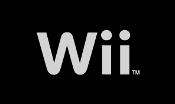

## Description
A simple unofficial mod of USB Loader GX, with just a white Wii logo.
Associated with a quick channel forwarder for USB Loader GX "apps/usbloader_gx/boot.dol" for a clean fast boot to your games!

## Installation
1. Replace the boot.dol file on your sd/usb drive, located here: "apps/usbloader_gx/boot.dol"
2. Copy the forwarder to the root of your sd/usb drive.
3. Launch Priiloader, chose Load/Install File, chose USB Loader GX Foarwarder.dol
4. Once installed, go to Settings, Autoboot, select "Installedd File".
5. Done!
